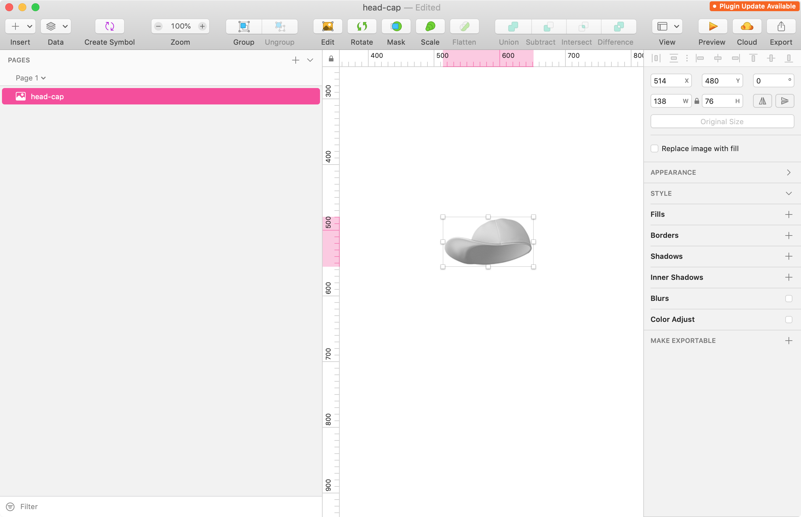
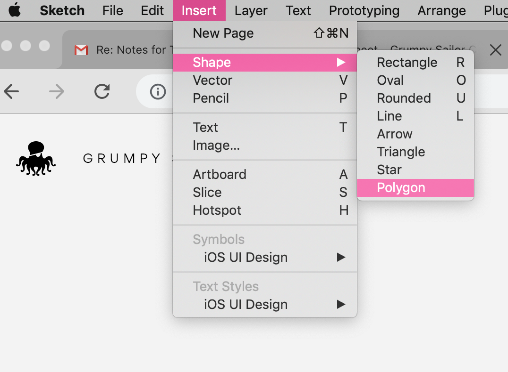
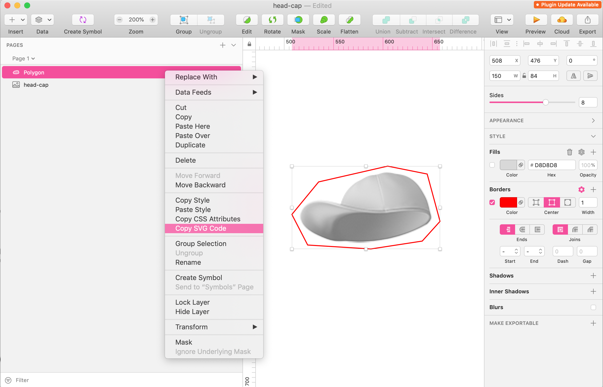
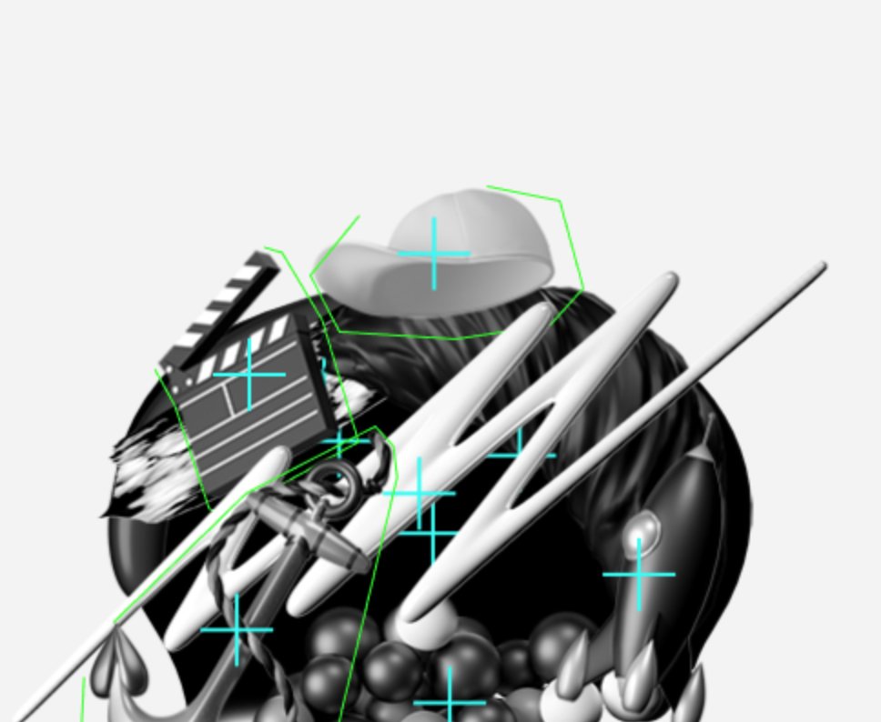

# Octopus Script


## Items Hitareas
Generate custom hitareas for Octopus Items with SketchApp

How to run the script: 

```
node items-hitareas.js
```

How to get the points from the path around the item

Open the item on Sketch App



Add a Polygon Shape




Add just the poligon around the item




SVG code from the example above:

```
<svg width="152px" height="86px" viewBox="0 0 152 86" version="1.1" xmlns="http://www.w3.org/2000/svg" xmlns:xlink="http://www.w3.org/1999/xlink">
    <g id="Page-1" stroke="none" stroke-width="1" fill="none" fill-rule="evenodd">
        <polygon id="Polygon" stroke="#FF0000" points="98 1 138 9 151 57 133 77 81 85 17 81 1 50 28 17"></polygon>
    </g>
</svg>
```

Use points' value:

```
"98 1 138 9 151 57 133 77 81 85 17 81 1 50 28 17"
```

open `items-hitarea.js` and add a new item:

```
// add (itemId, imageWidth, imageHeight, pointsString)
add('headCap', 138, 76, '98 1 138 9 151 57 133 77 81 85 17 81 1 50 28 17')
```

The script will round all the coordinates (21.002330 to 21) and will apply an offset of - half imageWidth and - half imageHeight.

After running the script you will get an output like:

```
---
headCap
[29, -37, 69, -29, 82, 19, 64, 39, 12, 47, -52, 43, -68, 12, -41, -21]
```

Copy that array value, open `_octopus/src/containers/octopus-items.js` 

find the line with the same itemId:

```
this.addImageItem('headCap', 635, 284, 120)
```

Paste the array into the fifth parameter:

```
this.addImageItem('headCap', 635, 284, 120, [29, -37, 69, -29, 82, 19, 64, 39, 12, 47, -52, 43, -68, 12, -41, -21])
```




## Items Hull points

On Remote easter egg we need a proper boundaries on octopus items to make the collision work fine.

How to run the script:

```
./image-to-hull/generate.sh
```
